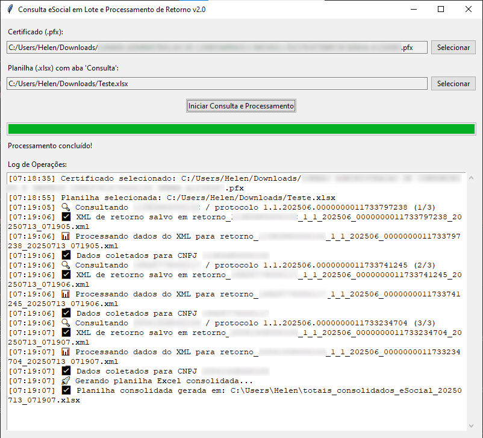
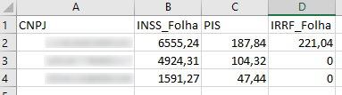

# eSocialAutomat

Intelligent system for batch automation of eSocial queries (Brazilian tax and labor XML standard), with consolidated return processing from events S-5011 and S-5012 into Excel spreadsheets.

Built for HR and Payroll professionals handling large volumes of XMLs, this tool brings performance, clarity, and process security.

## 🚀 Key Features

- Friendly graphical interface (Tkinter)
- Automatic reading of CNPJ and protocol numbers from Excel input
- XML query generation with digital certificate (.pfx)
- SOAP communication with eSocial endpoint
- Local storage of response XML files
- Automated extraction of values (INSS, PIS, IRRF)
- Consolidated output in Excel format

> Entirely developed using Python + Excel + PKI authentication

## 👥 Who is it for?

- Payroll analysts working with Brazilian eSocial obligations
- Accounting offices with multiple clients under eSocial
- HR teams aiming for automation and operational efficiency

## 🖼️ Screenshots

  

📽️ **Video demo**

## 🔒 Intellectual Property Notice

© Leonardo Figueiredo — All rights reserved.

This repository contains a **partial technical demonstration**.  
The full source code responsible for SOAP integration, XML parsing, certificate authentication, and extraction logic is **not included**, for protection and licensing purposes.

📩 Interested in a licensed version, tailored adaptation, or consulting?  
Contact: **leonardofigueiredo@hl.cnt.br**

## 💼 Professional Contact

- GitHub: [@jlfigueiredo](https://github.com/jlfigueiredo)
- E-mail: leonardofigueiredo@hl.cnt.br
