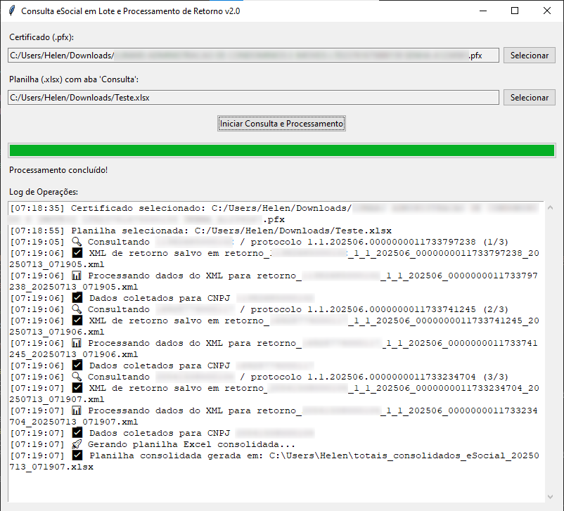
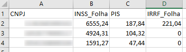

# eSocialAutomat

Sistema inteligente para automação de consultas ao eSocial em lote, com retorno consolidado de valores S-5011 e S-5012 em Excel.

Desenvolvido para analistas de Departamento Pessoal que lidam com alto volume de XMLs e precisam otimizar tempo, segurança e rastreabilidade das informações.

## 🚀 O que essa ferramenta faz

- Interface gráfica amigável (Tkinter)
- Leitura automática de CNPJ + protocolo de envio via planilha
- Geração de XML de consulta com certificado A1
- Envio por SOAP para o eSocial
- Armazenamento dos retornos XML
- Extração automática dos valores (INSS, PIS, IRRF)
- Geração de planilha Excel consolidada

> Solução desenvolvida 100% em Python + Excel + Certificado Digital

## 🎯 Para quem é

- Profissionais de DP que lidam com fechamento eSocial
- Escritórios contábeis que atendem múltiplas empresas
- Analistas de folha com foco em performance e precisão

## 📸 Capturas de tela

  

> ## Demonstração em vídeo
> 

## ⚠️ Direitos reservados

© Leonardo Figueiredo — Todos os direitos reservados.

Este projeto é uma **demonstração técnica parcial**.  
O código-fonte completo com as integrações SOAP, parsing XML, autenticação com certificado digital e algoritmos de extração **não está incluso neste repositório**, por questões de segurança e proteção de propriedade intelectual.

📩 **Deseja uma versão completa, adaptada ou licenciada para sua empresa?**  
Entre em contato: **leonardofigueiredo@hl.cnt.br**

## 💬 Contato profissional

- GitHub: [@jlfigueiredo](https://github.com/jlfigueiredo)
- E-mail: leonardofigueiredo@hl.cnt.br
